# lab2

# Установка ОС и настройка LVM, RAID
1.
1. Установка Linux
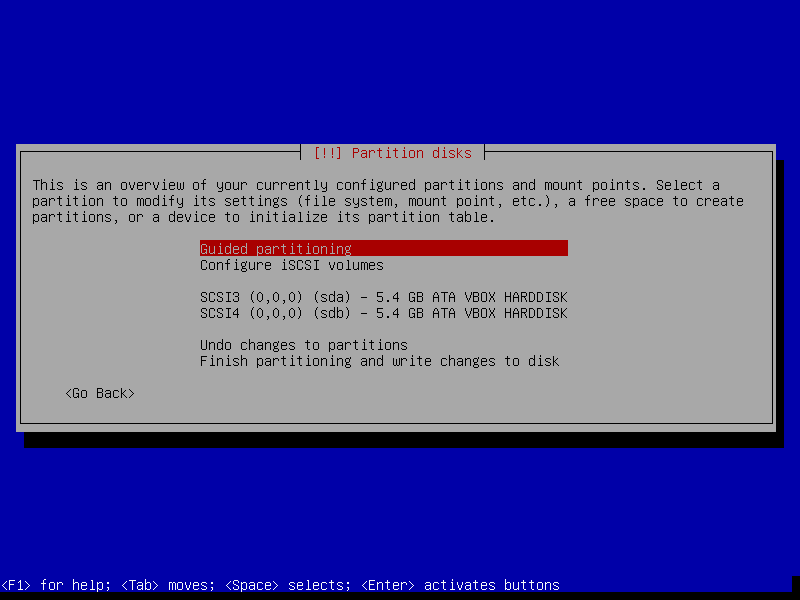

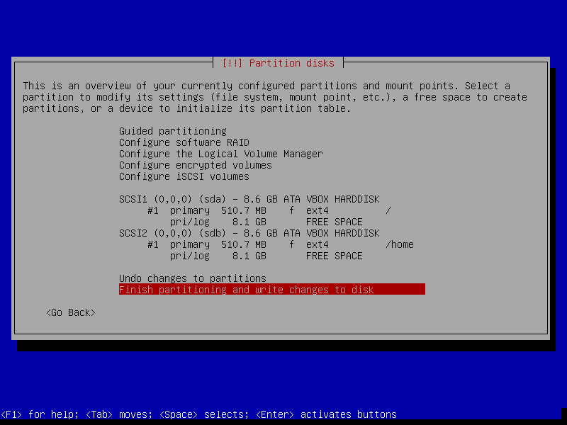

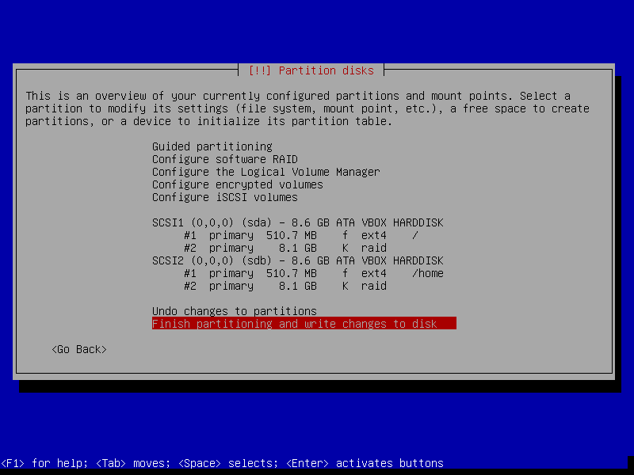

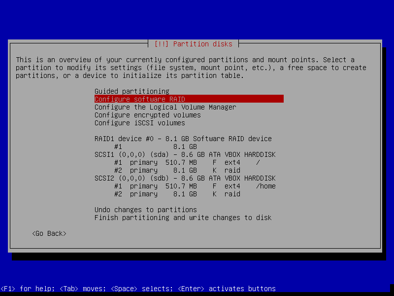

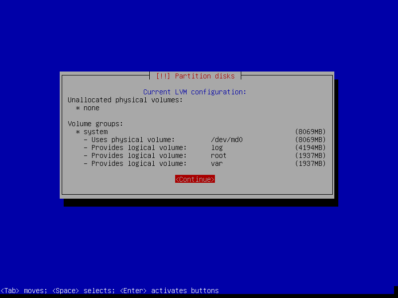

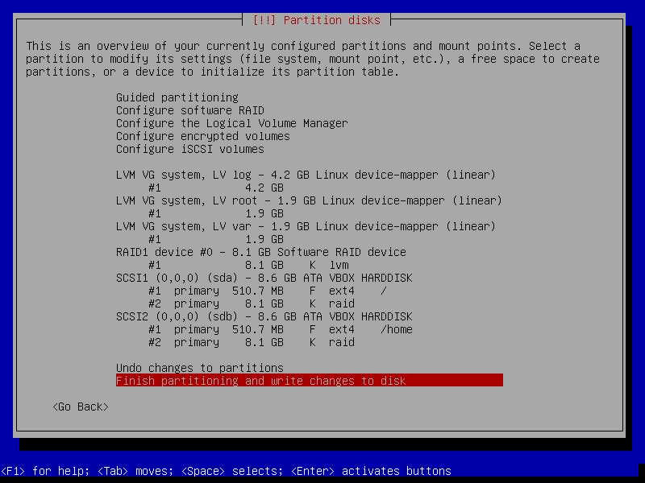

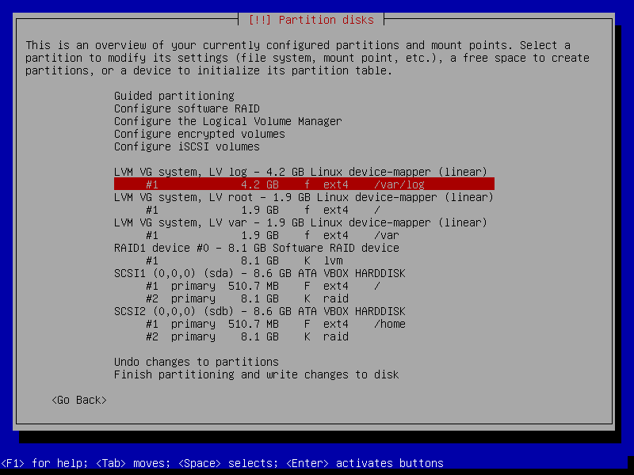

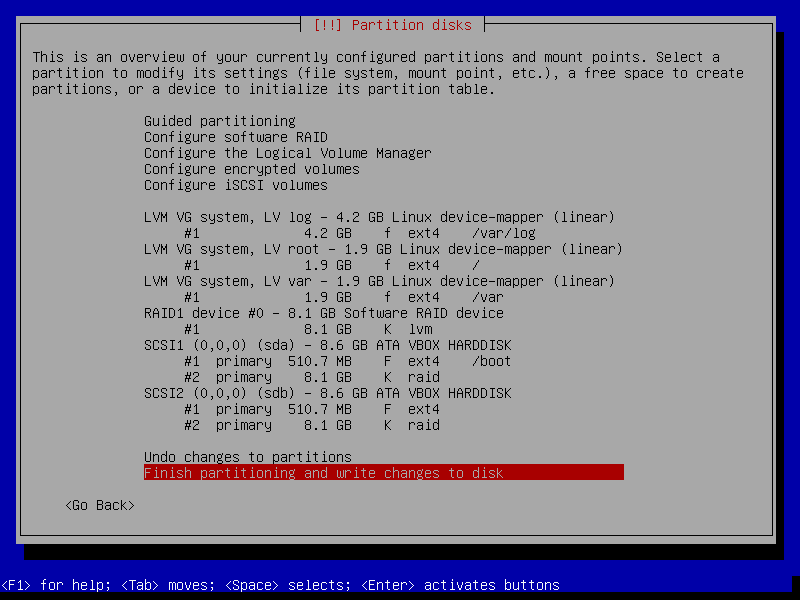

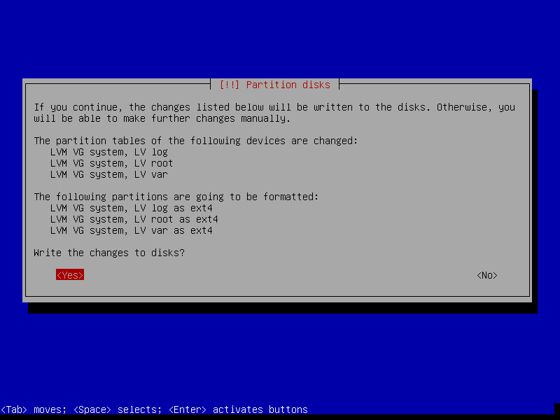

Поставил grub

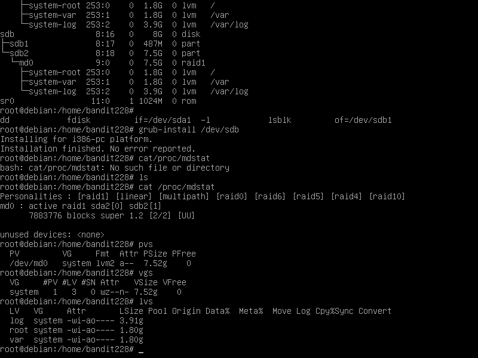

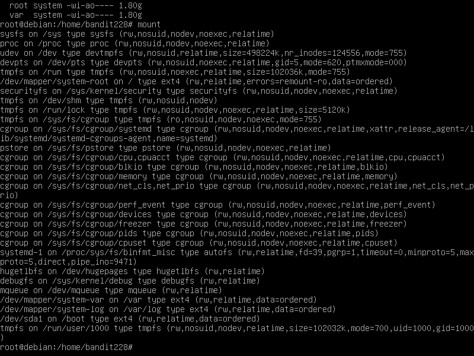

С помощью этих команд выводятся данные об physical volumes, volume groups, logical volumes, примонтированных устройствах.

# Вывод

В этой работе я научился устанавливать ОС Linux, настраивать LVM и RAID, а также ознакомился с командами: 

* lsblk -o NAME,SIZE,FSTYPE,TYPE,MOUNTPOINT

* fdisk -l
*+pvs,lvs,vgs

* cat /proc/mdstat

* mount

* dd if=/dev/xxx of=/dev/yyy

* grub-install /dev/XXX

В результате получил виртуальную машину с дисками ssd1, ssd2.

# Задание 2 (Эмуляция отказа одного из дисков)

1.1 Был удален 1 диск и добавлен новый
Проверяем что новый диск приехал в систему с помощью fdisk -l

Копирование таблиц разделов на новый диск с помощью sfdisk -d /dev/XXXX | sfdisk /dev/YYY

Добавление в рейд массив нового диска: mdadm --manage /dev/md0 --add /dev/YYY 

Результат cat /proc/mdstat/

Синхронизация разделов 

Установка grub на новый диск

Проверка что все работает

# Вывод

В этом задании научился:

* Удалять диск ssd1

* Проверять статус RAID-массива

* Копировать таблицу разделов со старого диска на новый

* Добавлять в рейд массив новый диск

* Выполнять синхронизацию разделов, не входящих в RAID

Изучил новые команды:

* sfdisk -d /dev/XXXX | sfdisk /dev/YYY

* mdadm --manage /dev/md0 --add /dev/YYY

Результат: Удален диск ssd1, добавлен диск ssd3, ssd2 сохранен

# Задание 3 (Добавление новых дисков и перенос раздела)

Удалили один диск и проверили состояние

Добавили новый диск

Копирование со старого диска на новый

Копирование /boot

Перемонтировка /boot на живой диск

Установка grub

Создание нового RAID-массива с включением туда только одного нового ssd диска: 

Проверка состояния RAID

Выполнение команды pvs для просмотра информации о текущих физических томах 

Создание нового физического тома, включив в него ранее созданный RAID массив: 

Выполнение -vgdisplay system -v
-pvs
-vgs
-lvs -a -o+devices

Перемещение данных со старого диска на новый

-vgdisplay system -v
-pvs
-vgs
-lvs -a -o+devices
-lsblk -o NAME,SIZE,FSTYPE,TYPE,MOUNTPOINT

Изменение VG, удалив из него диск старого raid. 

--lsblk -o NAME,SIZE,FSTYPE,TYPE,MOUNTPOINT
--pvs
--vgs
В выводе команды pvs у /dev/md0 исчезли VG и Attr. В выводе команды vgs #PV - уменьшилось на 1, VSize, VFree - стали меньше

Перемонтировка /boot на второ диск

Добавились новые диски

Скопировал таблицу разделов, установил grub

Изменение размера нового диска (второй раздел)

Перечитывание таблицы разделов

Добавление нового диска

Расширение кол-ва дисков в массиве до 2

Запуск fdisk /dev/sda

Таблица разделов

Расширение raid

--Вывод команды pvs
--Расширение размера PV
--Вывод команды pvs 

Имена новых дисков

Создание raid

Создание нового PV, в этом PV группы с названием data, логического тома с размером всего свободного пространства var_log 

Форматирование созданного раздела

Новое хранилище для логов

Синхронизация разделов и меняние их местами

Измнение /etc/fstab

Итоговая проверка

